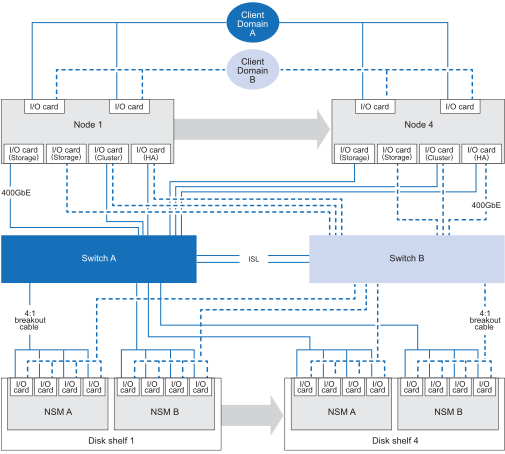

= 您的 AFX 2K 存储系统支持的配置
:allow-uri-read: 
:icons: font
:imagesdir: ../media/

[role="lead"]
了解 AFX 2K 存储系统支持的硬件组件和布线选项，包括正确设置系统所需的兼容存储磁盘盘架、交换机和电缆类型。

== 支持的AFX 2K布线配置

AFX 2K 存储系统的初始配置支持至少四个控制器节点，这些节点通过双交换机连接到存储磁盘盘架。

其他控制器节点和磁盘架可扩展初始 AFX 2K 存储系统配置。扩展的 AFX 2K 配置遵循与下述架构相同的基于交换机的布线方法。

== 支持的硬件组件

查看 AFX 2K 存储系统的兼容存储磁盘架、交换机和电缆类型。

[cols="35%,65%"]
|===
| 硬件组件 | 支持的电缆 

| AFX 2K（控制器架）  a| 
* 400GbE QDD至400GbE QSFP电缆（控制器至交换机连接）
* 用于管理连接的 RJ-45 电缆

| NX224（磁盘架）  a| 
* 400GbE QSFP-DD 分支至 4x100GbE QSFP 分支电缆（交换机至磁盘架连接）

| Cisco Nexus 9808 (交换机)  a| 
* 400GbE QSFP-DD 分支至 4x100GbE QSFP 分支电缆（交换机至磁盘架连接）
* 2 条 400GbE 电缆，用于交换机 A 和交换机 B 之间的 ISL 连接
* 用于管理连接的 RJ-45 电缆

| Cisco Nexus 9332D-GX2B (交换机)  a| 
* 400GbE QSFP-DD 分支至 4x100GbE QSFP 分支电缆（交换机至磁盘架连接）
* 2 条 400GbE 电缆，用于交换机 A 和交换机 B 之间的 ISL 连接
* 用于管理连接的 RJ-45 电缆

| Cisco Nexus 9364D-GX2A (交换机)  a| 
* 400GbE QSFP-DD 分支至 4x100GbE QSFP 分支电缆（交换机至磁盘架连接）
* 2 条 400GbE 电缆，用于交换机 A 和交换机 B 之间的 ISL 连接
* 用于管理连接的 RJ-45 电缆

|===
.下一步是什么？
在查看支持的系统配置和硬件组件后，link:install-network-reqs.html["查看 AFX 2K 存储系统的网络要求"]。
