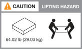

= AFX 2K存储系统的安装要求
:allow-uri-read: 
:icons: font
:imagesdir: ../media/

[role="lead"]
查看 AFX 2K 存储控制器和存储架所需的设备以及提升注意事项。

[[equipment-needed-for-install]]
== 安装所需的设备

要安装 AFX 2K 存储系统，需要以下设备和工具。

* 访问 Web 浏览器来配置您的存储系统
* 静电放电 (ESD) 腕带
* 手电筒
* 具有 USB/串行连接的笔记本电脑或控制台
* 用于设置存储架 ID 的回形针或细头圆珠笔
* 2 号十字螺丝刀

[[lifting-precautions]]
== 起重注意事项

AFX 存储控制器和存储架很重。抬起和移动这些物品时要小心。

[[storage-controller-weights]]
=== 存储控制器权重

移动或抬起 AFX 2K 存储控制器时，请采取必要的预防措施。

AFX 2K 存储控制器的重量可达 64.0 磅（29.03 千克）。要抬起存储控制器，请使用两人或液压升降机。

.AFX 2K控制器起吊预防措施。

[[storage-shelf-weights]]
=== 仓储货架重量

移动或抬起架子时请采取必要的预防措施。

.NX224货架
NX224 磁盘架的重量可达 60.1 磅（27.3 千克）。要抬起磁盘架，请使用两人或液压升降机。将所有组件保留在磁盘架中（前部和后部），以防止磁盘架重量不平衡。

.NX224 磁盘架提升注意事项。
image::../media/drw_nx224_lifting_weight_ieops-2437.svg[NX224 NSM100 吊装注意图标]

[[switch-weights]]
=== 交换机权重

移动或抬起交换机时，请采取必要的预防措施。

.Cisco Nexus 9808
空载的 Cisco 9808 重量可达 link:https://www.cisco.com/c/en/us/products/collateral/switches/nexus-9000-series-switches/nexus9800-series-switches-ds.html#Productspecifications["162 磅（73 千克），满载的 Cisco 9808 交换机最高可达 766 磅（347 千克）"^]。要抬起该交换机，请使用液压升降机。

.卸载的 Cisco Nexus 9808 起重注意事项。
image::../media/drw_afx_2k_weight_icon_ieops-2939.svg[Cisco Nexus 9808 吊装注意图标]

.全负载 Cisco Nexus 9808 吊装注意事项。
image::../media/drw_afx_2k_nexus9808_loaded_weight_caution_ieops-2940.svg[Cisco Nexus 9808 满载起重警告图标]

.Cisco Nexus9332D-GX2B
Cisco 9332D-GX2B 可重达 link:https://www.cisco.com/c/en/us/td/docs/dcn/hw/aci/nexus9000/9332d-gx2b/cisco-nexus-9332d-gx2b-aci-mode-switch-hardware-installation-guide/m_n93xxx_system_specs.html["12.7 千克（28.1 磅）"^]。

.Cisco Nexus 9364D-GX2A
Cisco Nexus 9364D-GX2A 交换机的重量可达link:https://www.cisco.com/c/en/us/td/docs/dcn/hw/nx-os/nexus9000/9364d-gx2a/cisco-nexus-9364d-gx2a-nx-os-mode-switch-hardware-installation-guide/m_n93xxx_system_specs.html["58 lb（26.3 kg）"^]。要抬起交换机，请使用两人或液压升降机。

.Cisco Nexus 9364D-GX2A 吊装预防措施。
image::../media/drw_afx_2k_9364d_weight_caution_ieops-2942.svg[Cisco Nexus 9364D-GX2A 吊装注意图标]

.相关信息
* https://library.netapp.com/ecm/ecm_download_file/ECMP12475945["安全信息和监管通知"^]

.下一步是什么？
在查看硬件要求后，您link:prepare-hardware.html["准备安装您的 AFX 2K 存储系统"]。
