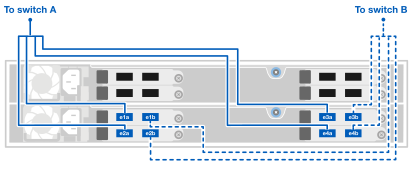

= 连接 AFX 1K 存储系统的硬件
:allow-uri-read: 
:icons: font
:imagesdir: ../media/

[role="lead"]
安装 AFX 1K 存储系统的机架硬件后，安装控制器的网络电缆，并连接控制器和存储架之间的电缆。

.开始之前
有关将存储系统连接到网络交换机的信息，请联系您的网络管理员。

.关于此任务
* 这些程序显示了常见的配置。具体的布线取决于您为存储系统订购的组件。有关全面的配置详细信息和插槽优先级，请参阅link:https://hwu.netapp.com["NetApp Hardware Universe"^]。
* AFX 控制器上的 I/O 插槽编号为 1 到 11。
+
image::../media/drw_a1K_back_slots_labeled_ieops-2162.svg[AFX 控制器上的插槽编号]

* 布线图形显示箭头图标，指示将连接器插入端口时电缆连接器拉片的正确方向（向上或向下）。
+
插入连接器时，您应该感觉到它咔哒一声到位；如果没有感觉到咔哒一声，请将其取出，翻转并重试。

+
image:../media/drw_cable_pull_tab_direction_ieops-1699.svg["电缆拉片方向"]

+
[NOTE]
====
连接器组件很精密，安装到位时应小心。

====
* 当布线到光纤连接时，先将光纤收发器插入控制器端口，然后再布线到交换机端口。
* AFX 1K 存储系统在集群和存储网络上使用 4x100GbE 分支电缆。 400GbE 连接与交换机端口相连，100GbE 连接与控制器和驱动器架端口相连。存储和 HA/集群连接可以与交换机上的任何非 ISL 端口建立。
+
对于给定的 4x100GbE 分支电缆连接到特定交换机端口，您可以使用这根分支电缆将给定控制器的所有四个端口连接到交换机。

+
** 1 个 HA 端口（插槽 1）
** 1 x 集群端口（插槽 7）
** 2 个存储端口（插槽 10、11）
+
所有“a”端口连接到交换机A，所有“b”端口连接到交换机B。

NOTE: Cisco Nexus 9332D-GX2B 和 9364D-GX2A 交换机配置到 AFX 1K 存储系统需要 4x100GbE 分支电缆连接。

== 步骤 1：将控制器连接到管理网络

将每个控制器上的管理（扳手）端口连接到任一管理交换机，或将其直接连接到您的管理网络。

使用 1000BASE-T RJ-45 电缆将每个控制器上的管理（扳手）端口连接到管理网络交换机。

image::../media/oie_cable_rj45.png[RJ-45 电缆]

*1000BASE-T RJ-45 电缆*

image::../media/drw_afx_management_connection_ieops-2815.svg[连接到您的管理网络]

IMPORTANT: 请勿插入电源线。

. 连接到主机网络。

== 步骤 2：将控制器连接到主机网络

将以太网模块端口连接到您的主机网络。

此过程可能因您的 I/O 模块配置而异。以下是一些典型的主机网络布线示例。看link:https://hwu.netapp.com["NetApp Hardware Universe"^]适合您的特定系统配置。

.步骤
. 将以下端口连接到以太网数据网络交换机 A。
+
** 控制器（示例）
+
*** e2a
*** e3a
+
*100GbE 电缆*

+
image::../media/oie_cable100_gbe_qsfp28.png[100 Gb 以太网电缆]

+
image::../media/drw_afx_network_cabling_a_ieops-2813.svg[以太网电缆]

. 将以下端口连接到以太网数据网络交换机 B。
+
** 控制器（示例）
+
*** e2b
*** e3b
+
*100GbE 电缆*

+
image::../media/oie_cable100_gbe_qsfp28.png[100 Gb 以太网电缆]

+
image::../media/drw_afx_network_cabling_b_ieops-2814.svg[以太网电缆]

== 步骤 3：将集群、HA 和存储连接连接到交换机 A

使用 4x100GbE 分支电缆将控制器上的集群、HA 和存储端口连接到网络交换机 A。集群和 HA 互连电缆将端口 e1a 和 e7a 连接到交换机 A。e1a 端口用于 HA 连接，e7a 端口用于集群连接。对于存储连接，将端口 e10a 和 e11a 连接到交换机 A。

确保您的交换机有正确的电缆和连接器。有关更多信息，请参见 https://hwu.netapp.com["Hardware Universe"^]。

.步骤
. 将以下控制器端口连接到网络交换机 A 上的任何非 ISL 端口。
+
** 控制器
+
*** e1a（HA）
*** e7a（集群）
*** e10a（存储）
*** e11a（存储）
+
*100GbE 电缆*

+
image::../media/oie_cable100_gbe_qsfp28.png[100 Gb 电缆]

+
image::../media/drw_afx_ha_cluster_storage_a_ieops-2779.svg[线缆控制器集群,HA,and storage to switch A]

== 步骤 4：将集群、HA 和存储连接连接到交换机 B

使用 4x100GbE 分支电缆将控制器上的集群、HA 和存储端口连接到网络交换机 B。集群和 HA 互连电缆将端口 e1b 和 e7b 连接到交换机 B。e1b 端口用于 HA 连接，e7b 端口用于集群连接。对于存储连接，将端口 e10b 和 e11b 连接到交换机 B。

确保您的交换机有正确的电缆和连接器。有关更多信息，请参见 https://hwu.netapp.com["Hardware Universe"^]。

. 将以下控制器端口连接到网络交换机 B 上的任何非 ISL 端口。
+
** 控制器
+
*** e1b（HA）
*** e7b（集群）
*** e10b (存储)
*** e11b（存储）
+
*100GbE 电缆*

+
image::../media/oie_cable100_gbe_qsfp28.png[100 Gb 电缆]

+
image::../media/drw_afx_ha_cluster_storage_b_ieops-2780.svg[线缆控制器集群,HA,and storage to switch B]

== 步骤 5：架设机架到交换机的连接线

将 NX224 存储扩展架连接到交换机。

有关存储系统支持的最大架数量以及所有布线选项，请参阅link:https://hwu.netapp.com["NetApp Hardware Universe"^]。

. 将以下机架端口连接到模块 A 的交换机 A 和交换机 B 上的任何非 ISL 端口。
+
** 模块 A 到交换机 A 的连接
+
*** e1a
*** e2a
*** e3a
*** e4a

** 模块 A 到交换机 B 的连接
+
*** e1b
*** e2b
*** e3b
*** e4b
+
*100GbE 电缆*

+
image::../media/oie_cable100_gbe_qsfp28.png[100 Gb 电缆]

+
image::../media/drw_afx_shelf_cabling_a_ieops-2356.svg[电缆架至交换机 A 和交换机 B]

. 将以下机架端口连接到交换机 A 和交换机 B 上用于模块 B 的任意非 ISL 端口。
+
** 模块 B 至交换机 A 的连接
+
*** e1a
*** e2a
*** e3a
*** e4a

** 模块 B 到交换机 B 的连接
+
*** e1b
*** e2b
*** e3b
*** e4b
+
*100GbE 电缆*

+
image::../media/oie_cable100_gbe_qsfp28.png[100 Gb 电缆]

+

.下一步是什么？
连接硬件后，link:power-on-configure-switch.html["打开电源并配置交换机"] 。
