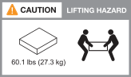

= AFX 1K 存储系统的安装要求
:allow-uri-read: 
:icons: font
:imagesdir: ../media/

[role="lead"]
查看 AFX 1K 存储控制器和存储架所需的设备以及提升预防措施。

== 安装所需的设备

要安装 AFX 1K 存储系统，您需要以下设备和工具。

* 访问 Web 浏览器来配置您的存储系统
* 静电放电 (ESD) 腕带
* 手电筒
* 具有 USB/串行连接的笔记本电脑或控制台
* 用于设置存储架 ID 的回形针或细头圆珠笔
* 2 号十字螺丝刀

== 起重注意事项

AFX 存储控制器和存储架很重。抬起和移动这些物品时要小心。

=== 存储控制器权重

移动或抬起 AFX 1K 存储控制器时请采取必要的预防措施。

AFX 1K 存储控制器的重量可达 62.83 磅（28.5 千克）。要抬起存储控制器，需要两个人或使用液压升降机。

image::../media/drw_a1k_weight_caution_ieops-1698.svg[ASA A1K 解除警告图标]

=== 仓储货架重量

移动或抬起架子时请采取必要的预防措施。

.NX224货架
--
NX224 架子的重量最多可达 60.1 磅（27.3 千克）。要抬起架子，需要两个人或使用液压升降机。将所有组件放在架子上（前部和后部），以防止架子重量不平衡。

.相关信息
* https://library.netapp.com/ecm/ecm_download_file/ECMP12475945["安全信息和监管通知"^]

.下一步是什么？
了解硬件要求后，link:prepare-hardware.html["准备安装您的 AFX 1K 存储系统"] 。

--