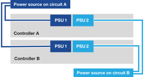

= 启动 AFX 1K 存储系统
:allow-uri-read: 
:icons: font
:imagesdir: ../media/

[role="lead"]
安装 AFX 1K 存储系统的机架硬件并安装控制器节点和存储架的电缆后，应打开存储架和控制器节点的电源。

== 步骤 1：打开机架电源并分配机架 ID

每个货架都有一个唯一的货架 ID，确保其在您的存储系统设置中具有区别性。

.关于此任务
* 有效的货架 ID 为 01 至 99。
* 您必须对机架进行电源循环（拔掉两根电源线，等待至少 10 秒钟，然后重新插入）才能使机架 ID 生效。

.步骤
. 首先将电源线连接到架子上，用电源线固定器将其固定到位，然后将电源线连接到不同电路的电源上，从而为架子供电。
+
插入电源后，架子会自动通电并启动。

. 取下左端盖即可看到面板后面的架子 ID 按钮。
+
image::../media/drw_tp_change_shelf_id_ieops-2381.svg[更改NX224货架ID]

+
[cols="20%,80%"]
|===

 a| 
image::../media/icon_round_1.png[标注编号 1]
 a| 
搁板端盖

 a| 
image::../media/icon_round_2.png[[标注 2]
 a| 
货架面板

 a| 
image::../media/icon_round_3.png[[标注 3]
 a| 
货架编号

 a| 
image::../media/icon_round_4.png[[标注编号 4]
 a| 
货架ID按钮

|===
. 更改货架ID的第一个数字：
+
.. 将回形针或细头圆珠笔的拉直端插入小孔，轻轻按下货架 ID 按钮。
.. 轻轻按住货架 ID 按钮，直到数字显示屏上的第一个数字闪烁，然后松开按钮。
+
数字在 15 秒内闪烁，激活货架 ID 编程模式。

+

NOTE: 如果 ID 闪烁的时间超过 15 秒，请再次按住货架 ID 按钮，确保将其完全按下。

.. 按下并释放货架 ID 按钮以增加数字，直到达到所需的数字（从 0 到 9）。
+
每次按下和释放的时间可以短至一秒钟。

+
第一个数字继续闪烁。

. 更改货架ID的第二个数字：
+
.. 按住按钮直到数字显示屏上的第二个数字闪烁。
+
数字闪烁最多可能需要三秒钟。

+
数字显示屏上的第一个数字停止闪烁。

.. 按下并释放货架 ID 按钮以增加数字，直到达到所需的数字（从 0 到 9）。
+
第二个数字继续闪烁。

. 锁定所需的号码并按住货架 ID 按钮直到第二个号码停止闪烁，退出编程模式。
+
数字停止闪烁最多可能需要三秒钟。

+
大约五秒钟后，数字显示屏上的两个数字开始闪烁，琥珀色 LED 亮起，提醒您待处理的货架 ID 尚未生效。

. 对架子进行电源循环至少 10 秒，以使架子 ID 生效。
+
.. 拔掉架子上两个电源的电源线。
.. 等待 10 秒钟。
.. 将电源线重新插入机架电源以完成电源循环。
+
只要插入电源线，电源就会打开。其双色 LED 应亮起绿色。

. 更换左端盖。

== 步骤 2：启动控制节点

打开存储架并为其分配唯一 ID 后，打开存储控制器节点的电源。

.步骤
. 将您的笔记本电脑连接到串行控制台端口。这使您可以监控控制器通电时的启动顺序。
+
.. 使用 N-8-1 将笔记本电脑上的串行控制台端口设置为 115,200 波特。
+
有关如何配置串行控制台端口的说明，请参阅笔记本电脑的在线帮助。

.. 将控制台电缆连接到笔记本电脑，然后使用存储系统附带的控制台电缆连接控制器上的串行控制台端口。
.. 将笔记本电脑连接到管理子网上的交换机。
+
image::../media/drw_a1k_70-90_console_connection_ieops-1702.svg[控制台连接]

. 使用管理子网上的 TCP/IP 地址为笔记本电脑分配一个 TCP/IP 地址。
. 将电源线插入控制器电源，然后将其连接到不同电路的电源。
+

+
** 系统开始启动。初始启动可能需要长达八分钟。
** LED 闪烁且风扇启动，表明控制器正在通电。
** 风扇在启动时可能会有噪音，这是正常现象。

. 使用每个电源上的固定装置固定电源线。

.下一步是什么？
打开 AFX 1K 存储系统后，您link:../install-setup/cluster-setup.html["设置 AFX 集群"]。
